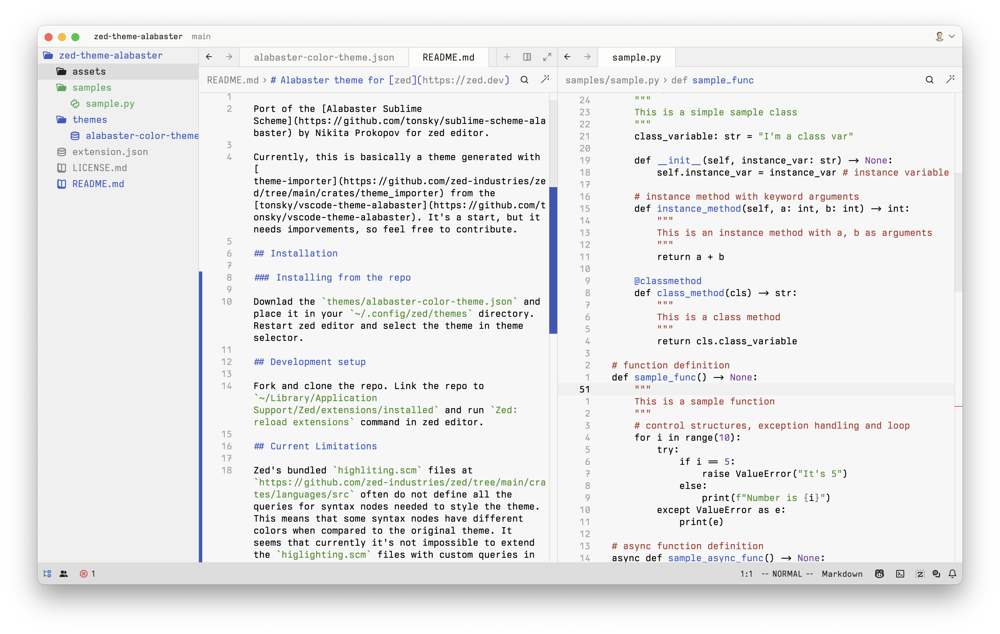

# Alabaster theme for [zed](https://zed.dev)

Port of the [Alabaster Sublime Scheme](https://github.com/tonsky/sublime-scheme-alabaster) by Nikita Prokopov for zed editor.

## Screenshots

## Current Limitations

Zed's bundled `highliting.scm` files at `https://github.com/zed-industries/zed/tree/main/crates/languages/src` often do not define all the queries for syntax nodes needed to style the theme. This means that some syntax nodes have different colors when compared to the original theme. It seems that currently it's not impossible to extend the `higlighting.scm` files with custom queries in the extension.
